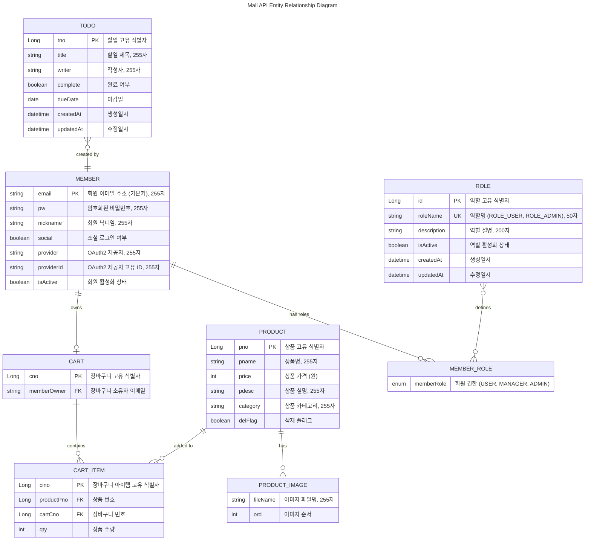

# Mall API 엔티티 및 관계 전체표 (길이 포함)

## ERD (Entity Relationship Diagram)



## 1. 엔티티 및 속성

| 엔티티명        | 필드명       | 타입         | PK  | FK           | NOT NULL | 길이/제약      | 설명                         | 예시값                    |
|----------------|-------------|-------------|-----|--------------|----------|----------------|------------------------------|---------------------------|
| Member         | email       | String      | ●   |              | ●        | 255자, UQ      | 회원 이메일 주소 (기본키)      | member@example.com        |
| Member         | pw          | String      |     |              |          | 255자          | 암호화된 비밀번호             | $2a$10$encrypted...       |
| Member         | nickname    | String      |     |              |          | 255자          | 회원 닉네임                  | 홍길동                     |
| Member         | social      | Boolean     |     |              | ●        |                | 소셜 로그인 여부             | true                      |
| Member         | provider    | String      |     |              |          | 255자          | OAuth2 제공자               | google                    |
| Member         | providerId  | String      |     |              |          | 255자          | OAuth2 제공자 고유 ID        | 123456789                 |
| Member         | isActive    | Boolean     |     |              |          |                | 회원 활성화 상태             | true                      |
| Role           | id          | Long        | ●   |              | ●        |                | 역할 고유 식별자             | 1                         |
| Role           | roleName    | String      |     |              | ●        | 50자, UQ       | 역할명                      | ROLE_USER                 |
| Role           | description | String      |     |              |          | 200자          | 역할 설명                   | 일반 사용자 권한            |
| Role           | isActive    | Boolean     |     |              | ●        |                | 역할 활성화 상태             | true                      |
| Role           | createdAt   | DateTime    |     |              | ●        |                | 생성일시                    | 2025-08-23T15:31:45       |
| Role           | updatedAt   | DateTime    |     |              | ●        |                | 수정일시                    | 2025-08-23T15:31:45       |
| MemberRole     | memberRole  | Enum        |     |              |          |                | 회원 권한 (USER/MANAGER/ADMIN)| USER                      |
| Product        | pno         | Long        | ●   |              | ●        |                | 상품 고유 식별자             | 1                         |
| Product        | pname       | String      |     |              |          | 255자          | 상품명                      | 갤럭시 S25                 |
| Product        | price       | Integer     |     |              | ●        |                | 상품 가격 (원)              | 1500000                   |
| Product        | pdesc       | String      |     |              |          | 255자          | 상품 설명                   | 최신 스마트폰              |
| Product        | category    | String      |     |              |          | 255자          | 상품 카테고리               | 전자제품                   |
| Product        | delFlag     | Boolean     |     |              | ●        |                | 삭제 플래그                 | false                     |
| ProductImage   | fileName    | String      |     |              |          | 255자          | 이미지 파일명               | galaxy_s25_01.jpg         |
| ProductImage   | ord         | Integer     |     |              |          |                | 이미지 순서                 | 0                         |
| Cart           | cno         | Long        | ●   |              | ●        |                | 장바구니 고유 식별자         | 1                         |
| Cart           | memberOwner | String      |     | Member.email | ●        | 255자          | 장바구니 소유자 이메일       | member@example.com        |
| CartItem       | cino        | Long        | ●   |              | ●        |                | 장바구니 아이템 고유 식별자   | 1                         |
| CartItem       | productPno  | Long        |     | Product.pno  | ●        |                | 상품 번호                   | 1                         |
| CartItem       | cartCno     | Long        |     | Cart.cno     | ●        |                | 장바구니 번호               | 1                         |
| CartItem       | qty         | Integer     |     |              | ●        |                | 상품 수량                   | 2                         |
| Todo           | tno         | Long        | ●   |              | ●        |                | 할일 고유 식별자             | 1                         |
| Todo           | title       | String      |     |              |          | 255자          | 할일 제목                   | 프로젝트 완료하기           |
| Todo           | writer      | String      |     |              |          | 255자          | 작성자                      | 홍길동                     |
| Todo           | complete    | Boolean     |     |              | ●        |                | 완료 여부                   | false                     |
| Todo           | dueDate     | Date        |     |              |          |                | 마감일                      | 2025-08-30                |
| Todo           | createdAt   | DateTime    |     |              | ●        |                | 생성일시                    | 2025-08-23T15:31:45       |
| Todo           | updatedAt   | DateTime    |     |              | ●        |                | 수정일시                    | 2025-08-23T15:31:45       |

> UQ = Unique(유일), PK = Primary Key, FK = Foreign Key

---

## 2. 엔티티 관계

| 관계명               | 출발 엔티티 | 도착 엔티티 | 관계 종류 | 설명                                      |
|---------------------|-------------|-------------|-----------|-------------------------------------------|
| Member-Cart         | Member      | Cart        | 1:1       | 한 회원은 하나의 장바구니를 가짐             |
| Cart-CartItem       | Cart        | CartItem    | 1:N       | 한 장바구니에는 여러 상품 아이템이 포함      |
| Product-CartItem    | Product     | CartItem    | 1:N       | 한 상품은 여러 장바구니에 담길 수 있음       |
| Product-ProductImage| Product     | ProductImage| 1:N       | 한 상품은 여러 이미지를 가질 수 있음         |
| Member-MemberRole   | Member      | MemberRole  | 1:N       | 한 회원은 여러 권한을 가질 수 있음          |
| Role-MemberRole     | Role        | MemberRole  | 1:N       | 한 역할은 여러 회원에게 부여될 수 있음       |
| Member-Todo         | Member      | Todo        | 1:N       | 한 회원은 여러 할일을 생성할 수 있음         |

---

## 3. 테이블 인덱스 정보

| 테이블명      | 인덱스명                    | 컬럼                  | 유형    | 설명                         |
|---------------|----------------------------|-----------------------|---------|------------------------------|
| members       | idx_member_email           | email                 | NORMAL  | 회원 이메일 검색 성능 향상    |
| members       | idx_member_provider_id     | provider, provider_id | NORMAL  | OAuth2 제공자별 검색 성능 향상|
| roles         | idx_role_name              | role_name             | UNIQUE  | 역할명 중복 방지 및 검색 최적화|
| tbl_cart      | idx_cart_email             | member_owner          | NORMAL  | 회원별 장바구니 검색 성능 향상 |
| tbl_cart_item | idx_cartitem_cart          | cart_cno              | NORMAL  | 장바구니별 아이템 검색 성능 향상|
| tbl_cart_item | idx_cartitem_pno_cart      | product_pno, cart_cno | NORMAL  | 상품-장바구니 복합 검색 최적화 |

## 4. 예시 데이터 (JSON)

### 4.1. MEMBER 엔티티 예시 데이터

```json
{
  "members": [
    {
      "email": "user@example.com",
      "pw": "$2a$10$encrypted_password_hash",
      "nickname": "일반사용자",
      "social": false,
      "provider": null,
      "providerId": null,
      "isActive": true,
      "memberRoleList": ["USER"]
    },
    {
      "email": "admin@example.com",
      "pw": "$2a$10$encrypted_admin_password",
      "nickname": "관리자",
      "social": false,
      "provider": null,
      "providerId": null,
      "isActive": true,
      "memberRoleList": ["USER", "ADMIN"]
    },
    {
      "email": "google_user@gmail.com",
      "pw": null,
      "nickname": "구글사용자",
      "social": true,
      "provider": "google",
      "providerId": "google_123456789",
      "isActive": true,
      "memberRoleList": ["USER"]
    }
  ]
}
```

### 4.2. PRODUCT 엔티티 예시 데이터

```json
{
  "products": [
    {
      "pno": 1,
      "pname": "갤럭시 S25 Ultra",
      "price": 1500000,
      "pdesc": "최신 프리미엄 스마트폰",
      "category": "전자제품",
      "delFlag": false,
      "imageList": [
        {
          "fileName": "galaxy_s25_ultra_01.jpg",
          "ord": 0
        },
        {
          "fileName": "galaxy_s25_ultra_02.jpg",
          "ord": 1
        }
      ]
    },
    {
      "pno": 2,
      "pname": "나이키 에어맥스",
      "price": 120000,
      "pdesc": "편안한 러닝화",
      "category": "의류",
      "delFlag": false,
      "imageList": [
        {
          "fileName": "nike_airmax_01.jpg",
          "ord": 0
        }
      ]
    }
  ]
}
```

### 4.3. CART & CART_ITEM 엔티티 예시 데이터

```json
{
  "carts": [
    {
      "cno": 1,
      "owner": {
        "email": "user@example.com",
        "nickname": "일반사용자"
      },
      "cartItems": [
        {
          "cino": 1,
          "product": {
            "pno": 1,
            "pname": "갤럭시 S25 Ultra",
            "price": 1500000
          },
          "qty": 1
        },
        {
          "cino": 2,
          "product": {
            "pno": 2,
            "pname": "나이키 에어맥스",
            "price": 120000
          },
          "qty": 2
        }
      ]
    }
  ]
}
```

### 4.4. TODO 엔티티 예시 데이터

```json
{
  "todos": [
    {
      "tno": 1,
      "title": "Spring Boot 프로젝트 완료",
      "writer": "홍길동",
      "complete": false,
      "dueDate": "2025-08-30",
      "createdAt": "2025-08-23T15:31:45Z",
      "updatedAt": "2025-08-23T15:31:45Z"
    },
    {
      "tno": 2,
      "title": "API 문서 작성",
      "writer": "김철수",
      "complete": true,
      "dueDate": "2025-08-25",
      "createdAt": "2025-08-20T10:00:00Z",
      "updatedAt": "2025-08-23T14:20:00Z"
    }
  ]
}
```

### 4.5. ROLE 엔티티 예시 데이터

```json
{
  "roles": [
    {
      "id": 1,
      "roleName": "ROLE_USER",
      "description": "일반 사용자 권한",
      "isActive": true,
      "createdAt": "2025-08-01T09:00:00Z",
      "updatedAt": "2025-08-01T09:00:00Z"
    },
    {
      "id": 2,
      "roleName": "ROLE_MANAGER",
      "description": "관리자 권한",
      "isActive": true,
      "createdAt": "2025-08-01T09:00:00Z",
      "updatedAt": "2025-08-01T09:00:00Z"
    },
    {
      "id": 3,
      "roleName": "ROLE_ADMIN",
      "description": "최고 관리자 권한",
      "isActive": true,
      "createdAt": "2025-08-01T09:00:00Z",
      "updatedAt": "2025-08-01T09:00:00Z"
    }
  ]
}
```

### 4.6. 관계형 데이터 조합 예시

#### 회원의 장바구니 정보 (JOIN 결과)

```json
{
  "memberWithCart": {
    "member": {
      "email": "user@example.com",
      "nickname": "일반사용자",
      "isActive": true
    },
    "cart": {
      "cno": 1,
      "totalItems": 3,
      "totalAmount": 1740000,
      "items": [
        {
          "product": {
            "pno": 1,
            "pname": "갤럭시 S25 Ultra",
            "price": 1500000,
            "category": "전자제품"
          },
          "qty": 1,
          "subtotal": 1500000
        },
        {
          "product": {
            "pno": 2,
            "pname": "나이키 에어맥스",
            "price": 120000,
            "category": "의류"
          },
          "qty": 2,
          "subtotal": 240000
        }
      ]
    }
  }
}
```

#### 상품별 장바구니 현황 (JOIN 결과)

```json
{
  "productInCarts": {
    "product": {
      "pno": 1,
      "pname": "갤럭시 S25 Ultra",
      "price": 1500000,
      "category": "전자제품"
    },
    "cartStatistics": {
      "totalCartsContaining": 5,
      "totalQuantity": 8,
      "averageQuantityPerCart": 1.6
    },
    "cartDetails": [
      {
        "cart": {
          "cno": 1,
          "owner": "user@example.com"
        },
        "qty": 1
      },
      {
        "cart": {
          "cno": 3,
          "owner": "admin@example.com"
        },
        "qty": 2
      }
    ]
  }
}
```

### 4.7. 권한(MemberRole) 정의

```json
{
  "memberRoleDefinitions": {
    "USER": {
      "code": "USER",
      "name": "일반 사용자",
      "description": "기본적인 쇼핑몰 이용 권한",
      "permissions": ["PRODUCT_VIEW", "CART_MANAGE", "ORDER_CREATE"]
    },
    "MANAGER": {
      "code": "MANAGER",
      "name": "관리자",
      "description": "상품 및 주문 관리 권한",
      "permissions": ["PRODUCT_VIEW", "PRODUCT_MANAGE", "ORDER_MANAGE", "USER_VIEW"]
    },
    "ADMIN": {
      "code": "ADMIN",
      "name": "최고 관리자",
      "description": "시스템 전체 관리 권한",
      "permissions": ["ALL_PERMISSIONS"]
    }
  }
}
```

---

