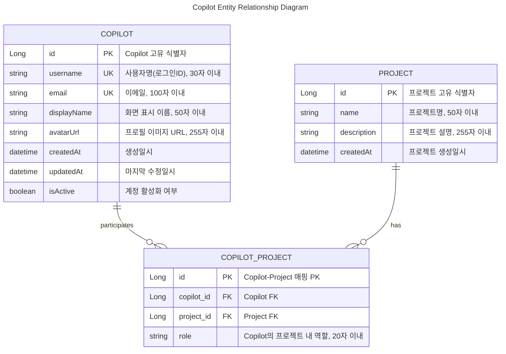

# Copilot 엔티티 및 관계 전체표 (길이 포함)

## ERD (Entity Relationship Diagram)



## 1. 엔티티 및 속성

| 엔티티명        | 필드명      | 타입         | PK  | FK           | NOT NULL | 길이/제약      | 설명                         | 예시값                |
|-----------------|------------|-------------|-----|--------------|----------|----------------|------------------------------|-----------------------|
| Copilot         | id         | Long        | ●   |              | ●        |                | Copilot 고유 식별자          | 1                     |
| Copilot         | username   | String      |     |              | ●        | 30자 이내, UQ  | 사용자명(로그인ID)           | copilot123            |
| Copilot         | email      | String      |     |              | ●        | 100자 이내, UQ | 이메일                       | copilot@example.com   |
| Copilot         | displayName| String      |     |              |          | 50자 이내      | 화면 표시 이름               | Copilot Kim           |
| Copilot         | avatarUrl  | String      |     |              |          | 255자 이내     | 프로필 이미지 URL            | https://.../img.png   |
| Copilot         | createdAt  | DateTime    |     |              | ●        |                | 생성일시                     | 2025-08-21T06:00:00   |
| Copilot         | updatedAt  | DateTime    |     |              |          |                | 마지막 수정일시              | 2025-08-22T01:11:00   |
| Copilot         | isActive   | Boolean     |     |              |          |                | 계정 활성화 여부             | true                  |
| Project         | id         | Long        | ●   |              | ●        |                | 프로젝트 고유 식별자         | 101                   |
| Project         | name       | String      |     |              | ●        | 50자 이내      | 프로젝트명                   | AI Assistant          |
| Project         | description| String      |     |              |          | 255자 이내     | 프로젝트 설명                | Copilot 연동 프로젝트 |
| Project         | createdAt  | DateTime    |     |              | ●        |                | 프로젝트 생성일시            | 2025-07-01T10:00:00   |
| CopilotProject  | id         | Long        | ●   |              | ●        |                | Copilot-Project 매핑 PK      | 1001                  |
| CopilotProject  | copilot_id | Long        |     | Copilot.id   | ●        |                | Copilot FK                   | 1                     |
| CopilotProject  | project_id | Long        |     | Project.id   | ●        |                | Project FK                   | 101                   |
| CopilotProject  | role       | String      |     |              |          | 20자 이내      | Copilot의 프로젝트 내 역할   | MANAGER               |

> UQ = Unique(유일), PK = Primary Key, FK = Foreign Key

---

## 2. 엔티티 관계

| 관계명              | 출발 엔티티 | 도착 엔티티 | 관계 종류 | 설명                                      |
|---------------------|-------------|-------------|-----------|-------------------------------------------|
| Copilot-Project     | Copilot     | Project     | N:M       | 한 Copilot이 여러 Project에 참여 가능      |
| CopilotProject-Ref  | CopilotProject | Copilot  | N:1       | CopilotProject는 하나의 Copilot을 참조    |
| CopilotProject-Ref  | CopilotProject | Project  | N:1       | CopilotProject는 하나의 Project를 참조    |

---

## 3. 예시 데이터 (JSON)

### 3.1. COPILOT 엔티티 예시 데이터

```json
{
  "copilots": [
    {
      "id": 1,
      "username": "copilot123",
      "email": "copilot@example.com",
      "displayName": "Copilot Kim",
      "avatarUrl": "https://example.com/avatars/copilot123.png",
      "createdAt": "2025-08-21T06:00:00Z",
      "updatedAt": "2025-08-22T01:11:00Z",
      "isActive": true
    },
    {
      "id": 2,
      "username": "devassist",
      "email": "dev.assistant@company.com",
      "displayName": "Dev Assistant",
      "avatarUrl": "https://example.com/avatars/devassist.png",
      "createdAt": "2025-07-15T10:30:00Z",
      "updatedAt": "2025-08-20T14:22:00Z",
      "isActive": true
    },
    {
      "id": 3,
      "username": "codehelper",
      "email": "helper@tech.org",
      "displayName": "Code Helper",
      "avatarUrl": null,
      "createdAt": "2025-06-01T08:45:00Z",
      "updatedAt": "2025-08-18T09:33:00Z",
      "isActive": false
    }
  ]
}
```

### 3.2. PROJECT 엔티티 예시 데이터

```json
{
  "projects": [
    {
      "id": 101,
      "name": "AI Assistant",
      "description": "Copilot 연동 프로젝트",
      "createdAt": "2025-07-01T10:00:00Z"
    },
    {
      "id": 102,
      "name": "Smart Analytics",
      "description": "데이터 분석 및 시각화 플랫폼",
      "createdAt": "2025-06-15T14:30:00Z"
    },
    {
      "id": 103,
      "name": "E-Commerce Backend",
      "description": "온라인 쇼핑몰 백엔드 API 개발",
      "createdAt": "2025-08-01T09:15:00Z"
    },
    {
      "id": 104,
      "name": "Mobile App Suite",
      "description": "크로스 플랫폼 모바일 애플리케이션",
      "createdAt": "2025-05-20T16:45:00Z"
    }
  ]
}
```

### 3.3. COPILOT_PROJECT 엔티티 예시 데이터

```json
{
  "copilotProjects": [
    {
      "id": 1001,
      "copilot_id": 1,
      "project_id": 101,
      "role": "MANAGER"
    },
    {
      "id": 1002,
      "copilot_id": 1,
      "project_id": 102,
      "role": "DEVELOPER"
    },
    {
      "id": 1003,
      "copilot_id": 2,
      "project_id": 101,
      "role": "DEVELOPER"
    },
    {
      "id": 1004,
      "copilot_id": 2,
      "project_id": 103,
      "role": "LEAD"
    },
    {
      "id": 1005,
      "copilot_id": 3,
      "project_id": 104,
      "role": "CONSULTANT"
    }
  ]
}
```

### 3.4. 관계형 데이터 조합 예시

#### 특정 Copilot의 참여 프로젝트 정보 (JOIN 결과)

```json
{
  "copilotWithProjects": {
    "copilot": {
      "id": 1,
      "username": "copilot123",
      "email": "copilot@example.com",
      "displayName": "Copilot Kim",
      "isActive": true
    },
    "projects": [
      {
        "project": {
          "id": 101,
          "name": "AI Assistant",
          "description": "Copilot 연동 프로젝트"
        },
        "role": "MANAGER"
      },
      {
        "project": {
          "id": 102,
          "name": "Smart Analytics",
          "description": "데이터 분석 및 시각화 플랫폼"
        },
        "role": "DEVELOPER"
      }
    ]
  }
}
```

#### 특정 프로젝트의 참여 Copilot 정보 (JOIN 결과)

```json
{
  "projectWithCopilots": {
    "project": {
      "id": 101,
      "name": "AI Assistant",
      "description": "Copilot 연동 프로젝트",
      "createdAt": "2025-07-01T10:00:00Z"
    },
    "participants": [
      {
        "copilot": {
          "id": 1,
          "username": "copilot123",
          "displayName": "Copilot Kim",
          "email": "copilot@example.com"
        },
        "role": "MANAGER"
      },
      {
        "copilot": {
          "id": 2,
          "username": "devassist",
          "displayName": "Dev Assistant",
          "email": "dev.assistant@company.com"
        },
        "role": "DEVELOPER"
      }
    ]
  }
}
```

### 3.5. 역할(Role) 코드 정의

```json
{
  "roleDefinitions": {
    "MANAGER": {
      "code": "MANAGER",
      "name": "프로젝트 매니저",
      "description": "프로젝트 전체 관리 및 의사결정 권한",
      "permissions": ["READ", "WRITE", "DELETE", "MANAGE_MEMBERS"]
    },
    "LEAD": {
      "code": "LEAD",
      "name": "팀 리드",
      "description": "팀 기술 리더십 및 개발 가이드",
      "permissions": ["READ", "WRITE", "CODE_REVIEW"]
    },
    "DEVELOPER": {
      "code": "DEVELOPER",
      "name": "개발자",
      "description": "기능 개발 및 구현 담당",
      "permissions": ["READ", "WRITE"]
    },
    "CONSULTANT": {
      "code": "CONSULTANT",
      "name": "컨설턴트",
      "description": "기술 자문 및 검토 역할",
      "permissions": ["READ", "COMMENT"]
    }
  }
}
```

---

