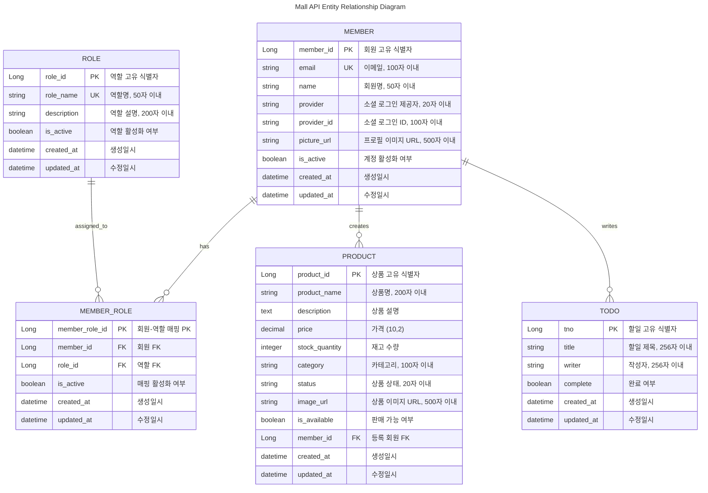

# Mall API 엔티티 및 관계 전체표 (길이 포함)

## ERD (Entity Relationship Diagram)



## 1. 엔티티 및 속성

| 엔티티명     | 필드명         | 타입         | PK  | FK           | NOT NULL | 길이/제약      | 설명                    | 예시값                     |
|-------------|---------------|-------------|-----|--------------|----------|----------------|-------------------------|---------------------------|
| Member      | member_id     | Long        | ●   |              | ●        |                | 회원 고유 식별자         | 1                         |
| Member      | email         | String      |     |              | ●        | 100자 이내, UQ | 이메일                  | user@example.com          |
| Member      | name          | String      |     |              | ●        | 50자 이내      | 회원명                  | 홍길동                    |
| Member      | provider      | String      |     |              |          | 20자 이내      | 소셜 로그인 제공자      | GOOGLE                    |
| Member      | provider_id   | String      |     |              |          | 100자 이내     | 소셜 로그인 ID          | google_123456             |
| Member      | picture_url   | String      |     |              |          | 500자 이내     | 프로필 이미지 URL       | https://example.com/pic   |
| Member      | is_active     | Boolean     |     |              |          |                | 계정 활성화 여부        | true                      |
| Member      | created_at    | DateTime    |     |              | ●        |                | 생성일시                | 2025-08-21T10:00:00       |
| Member      | updated_at    | DateTime    |     |              |          |                | 수정일시                | 2025-08-21T10:00:00       |
| Role        | role_id       | Long        | ●   |              | ●        |                | 역할 고유 식별자        | 1                         |
| Role        | role_name     | String      |     |              | ●        | 50자 이내, UQ  | 역할명                  | USER                      |
| Role        | description   | String      |     |              |          | 200자 이내     | 역할 설명               | 일반 사용자               |
| Role        | is_active     | Boolean     |     |              |          |                | 역할 활성화 여부        | true                      |
| Role        | created_at    | DateTime    |     |              | ●        |                | 생성일시                | 2025-08-21T10:00:00       |
| Role        | updated_at    | DateTime    |     |              |          |                | 수정일시                | 2025-08-21T10:00:00       |
| MemberRole  | member_role_id| Long        | ●   |              | ●        |                | 회원-역할 매핑 PK       | 1                         |
| MemberRole  | member_id     | Long        |     | Member.id    | ●        |                | 회원 FK                 | 1                         |
| MemberRole  | role_id       | Long        |     | Role.id      | ●        |                | 역할 FK                 | 1                         |
| MemberRole  | is_active     | Boolean     |     |              |          |                | 매핑 활성화 여부        | true                      |
| MemberRole  | created_at    | DateTime    |     |              | ●        |                | 생성일시                | 2025-08-21T10:00:00       |
| MemberRole  | updated_at    | DateTime    |     |              |          |                | 수정일시                | 2025-08-21T10:00:00       |
| Product     | product_id    | Long        | ●   |              | ●        |                | 상품 고유 식별자        | 1                         |
| Product     | product_name  | String      |     |              | ●        | 200자 이내     | 상품명                  | 스마트폰                  |
| Product     | description   | Text        |     |              |          | TEXT           | 상품 설명               | 최신 스마트폰입니다       |
| Product     | price         | Decimal     |     |              | ●        | (10,2)         | 가격                    | 1200000.00                |
| Product     | stock_quantity| Integer     |     |              | ●        |                | 재고 수량               | 50                        |
| Product     | category      | String      |     |              |          | 100자 이내     | 카테고리                | 전자제품                  |
| Product     | status        | String      |     |              |          | 20자 이내      | 상품 상태               | ACTIVE                    |
| Product     | image_url     | String      |     |              |          | 500자 이내     | 상품 이미지 URL         | https://example.com/img   |
| Product     | is_available  | Boolean     |     |              | ●        |                | 판매 가능 여부          | true                      |
| Product     | member_id     | Long        |     | Member.id    |          |                | 등록 회원 FK            | 1                         |
| Product     | created_at    | DateTime    |     |              | ●        |                | 생성일시                | 2025-08-21T10:00:00       |
| Product     | updated_at    | DateTime    |     |              |          |                | 수정일시                | 2025-08-21T10:00:00       |
| Todo        | tno           | Long        | ●   |              | ●        |                | 할일 고유 식별자        | 1                         |
| Todo        | title         | String      |     |              | ●        | 256자 이내     | 할일 제목               | 프로젝트 완료하기         |
| Todo        | writer        | String      |     |              | ●        | 256자 이내     | 작성자                  | 홍길동                    |
| Todo        | complete      | Boolean     |     |              | ●        |                | 완료 여부               | false                     |
| Todo        | created_at    | DateTime    |     |              | ●        |                | 생성일시                | 2025-08-21T10:00:00       |
| Todo        | updated_at    | DateTime    |     |              |          |                | 수정일시                | 2025-08-21T10:00:00       |

> UQ = Unique(유일), PK = Primary Key, FK = Foreign Key

---

## 2. 엔티티 관계

| 관계명              | 출발 엔티티 | 도착 엔티티 | 관계 종류 | 설명                                      |
|---------------------|-------------|-------------|-----------|-------------------------------------------|
| Member-MemberRole   | Member      | MemberRole  | 1:N       | 한 회원이 여러 역할을 가질 수 있음         |
| Role-MemberRole     | Role        | MemberRole  | 1:N       | 한 역할이 여러 회원에게 할당될 수 있음     |
| Member-Product      | Member      | Product     | 1:N       | 한 회원이 여러 상품을 등록할 수 있음       |
| Member-Todo         | Member      | Todo        | 1:N       | 한 회원이 여러 할일을 작성할 수 있음       |

---

## 3. 예시 데이터 (JSON)

### 3.1. MEMBER 엔티티 예시 데이터

```json
{
  "members": [
    {
      "member_id": 1,
      "email": "user@example.com",
      "name": "홍길동",
      "provider": "GOOGLE",
      "provider_id": "google_123456",
      "picture_url": "https://example.com/profile/user1.jpg",
      "is_active": true,
      "created_at": "2025-08-21T10:00:00Z",
      "updated_at": "2025-08-21T10:00:00Z"
    },
    {
      "member_id": 2,
      "email": "admin@example.com",
      "name": "관리자",
      "provider": "LOCAL",
      "provider_id": null,
      "picture_url": null,
      "is_active": true,
      "created_at": "2025-08-20T09:00:00Z",
      "updated_at": "2025-08-21T15:30:00Z"
    },
    {
      "member_id": 3,
      "email": "seller@example.com",
      "name": "판매자김",
      "provider": "KAKAO",
      "provider_id": "kakao_789012",
      "picture_url": "https://example.com/profile/seller3.jpg",
      "is_active": true,
      "created_at": "2025-08-19T14:22:00Z",
      "updated_at": "2025-08-21T11:45:00Z"
    }
  ]
}
```

### 3.2. ROLE 엔티티 예시 데이터

```json
{
  "roles": [
    {
      "role_id": 1,
      "role_name": "USER",
      "description": "일반 사용자",
      "is_active": true,
      "created_at": "2025-08-21T10:00:00Z",
      "updated_at": "2025-08-21T10:00:00Z"
    },
    {
      "role_id": 2,
      "role_name": "ADMIN",
      "description": "시스템 관리자",
      "is_active": true,
      "created_at": "2025-08-21T10:00:00Z",
      "updated_at": "2025-08-21T10:00:00Z"
    },
    {
      "role_id": 3,
      "role_name": "SELLER",
      "description": "상품 판매자",
      "is_active": true,
      "created_at": "2025-08-21T10:00:00Z",
      "updated_at": "2025-08-21T10:00:00Z"
    }
  ]
}
```

### 3.3. MEMBER_ROLE 엔티티 예시 데이터

```json
{
  "memberRoles": [
    {
      "member_role_id": 1,
      "member_id": 1,
      "role_id": 1,
      "is_active": true,
      "created_at": "2025-08-21T10:00:00Z",
      "updated_at": "2025-08-21T10:00:00Z"
    },
    {
      "member_role_id": 2,
      "member_id": 2,
      "role_id": 2,
      "is_active": true,
      "created_at": "2025-08-20T09:00:00Z",
      "updated_at": "2025-08-20T09:00:00Z"
    },
    {
      "member_role_id": 3,
      "member_id": 3,
      "role_id": 3,
      "is_active": true,
      "created_at": "2025-08-19T14:22:00Z",
      "updated_at": "2025-08-19T14:22:00Z"
    },
    {
      "member_role_id": 4,
      "member_id": 3,
      "role_id": 1,
      "is_active": true,
      "created_at": "2025-08-19T14:23:00Z",
      "updated_at": "2025-08-19T14:23:00Z"
    }
  ]
}
```

### 3.4. PRODUCT 엔티티 예시 데이터

```json
{
  "products": [
    {
      "product_id": 1,
      "product_name": "갤럭시 S24",
      "description": "삼성 최신 스마트폰, 256GB 저장용량",
      "price": 1200000.00,
      "stock_quantity": 50,
      "category": "전자제품",
      "status": "ACTIVE",
      "image_url": "https://example.com/products/galaxy-s24.jpg",
      "is_available": true,
      "member_id": 3,
      "created_at": "2025-08-21T10:00:00Z",
      "updated_at": "2025-08-21T10:00:00Z"
    },
    {
      "product_id": 2,
      "product_name": "무선 이어폰",
      "description": "고음질 블루투스 이어폰, 노이즈 캔슬링 기능",
      "price": 180000.00,
      "stock_quantity": 100,
      "category": "전자제품",
      "status": "ACTIVE",
      "image_url": "https://example.com/products/earphones.jpg",
      "is_available": true,
      "member_id": 3,
      "created_at": "2025-08-20T15:30:00Z",
      "updated_at": "2025-08-21T09:15:00Z"
    },
    {
      "product_id": 3,
      "product_name": "운동화",
      "description": "편안한 러닝화, 사이즈 260",
      "price": 89000.00,
      "stock_quantity": 25,
      "category": "의류",
      "status": "ACTIVE",
      "image_url": "https://example.com/products/shoes.jpg",
      "is_available": true,
      "member_id": 1,
      "created_at": "2025-08-19T11:20:00Z",
      "updated_at": "2025-08-20T16:45:00Z"
    }
  ]
}
```

### 3.5. TODO 엔티티 예시 데이터

```json
{
  "todos": [
    {
      "tno": 1,
      "title": "Mall API 개발 완료",
      "writer": "홍길동",
      "complete": false,
      "created_at": "2025-08-21T10:00:00Z",
      "updated_at": "2025-08-21T10:00:00Z"
    },
    {
      "tno": 2,
      "title": "상품 등록 기능 테스트",
      "writer": "판매자김",
      "complete": true,
      "created_at": "2025-08-20T14:30:00Z",
      "updated_at": "2025-08-21T09:45:00Z"
    },
    {
      "tno": 3,
      "title": "회원 권한 관리 시스템 구축",
      "writer": "관리자",
      "complete": false,
      "created_at": "2025-08-19T16:20:00Z",
      "updated_at": "2025-08-21T11:30:00Z"
    }
  ]
}
```

### 3.6. 관계형 데이터 조합 예시

#### 회원의 역할 정보 (JOIN 결과)

```json
{
  "memberWithRoles": {
    "member": {
      "member_id": 3,
      "email": "seller@example.com",
      "name": "판매자김",
      "provider": "KAKAO"
    },
    "roles": [
      {
        "role_id": 3,
        "role_name": "SELLER",
        "description": "상품 판매자"
      },
      {
        "role_id": 1,
        "role_name": "USER",
        "description": "일반 사용자"
      }
    ]
  }
}
```

#### 회원이 등록한 상품 정보 (JOIN 결과)

```json
{
  "memberWithProducts": {
    "member": {
      "member_id": 3,
      "name": "판매자김",
      "email": "seller@example.com"
    },
    "products": [
      {
        "product_id": 1,
        "product_name": "갤럭시 S24",
        "price": 1200000.00,
        "stock_quantity": 50,
        "is_available": true
      },
      {
        "product_id": 2,
        "product_name": "무선 이어폰",
        "price": 180000.00,
        "stock_quantity": 100,
        "is_available": true
      }
    ]
  }
}
```

### 3.7. 상태 코드 정의

```json
{
  "statusDefinitions": {
    "productStatus": {
      "ACTIVE": {
        "code": "ACTIVE",
        "name": "판매중",
        "description": "현재 판매 중인 상품"
      },
      "INACTIVE": {
        "code": "INACTIVE",
        "name": "판매중지",
        "description": "판매가 중지된 상품"
      },
      "SOLDOUT": {
        "code": "SOLDOUT",
        "name": "품절",
        "description": "재고가 없는 상품"
      }
    },
    "memberProvider": {
      "LOCAL": {
        "code": "LOCAL",
        "name": "로컬 계정",
        "description": "이메일/패스워드 기반 계정"
      },
      "GOOGLE": {
        "code": "GOOGLE",
        "name": "구글 계정",
        "description": "구글 소셜 로그인 계정"
      },
      "KAKAO": {
        "code": "KAKAO",
        "name": "카카오 계정",
        "description": "카카오 소셜 로그인 계정"
      }
    }
  }
}
```

---
